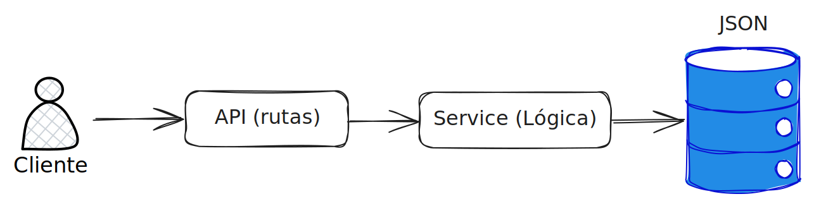

<h1 align="center">
    
    <br>
    Capusotto API
</h1>

## Descripción del proyecto
API de los personajes de Peter Capusotto📺. Escrita en Python, aplicando buenas prácticas y coso.

- Desarrollado con Python 3.13.3

## Diagrama de diseño



## Cómo correr el proyecto 🚀

```bash
git clone https://github.com/juancruzromero/capusotto-api
cd capusotto-api
pip install -r requirements.txt
uvicorn main:app --reload --host 0.0.0.0 --port 8000
```
### Con Docker 🐳:

```bash
git clone https://github.com/juancruzromero/capusotto-api
cd capusotto-api
docker build -t capusotto-api .
docker run -d -p 8000:8000 capusotto-api
```

## Features principales ⭐
- Listar personajes
- Obtener detalles de un personaje

**Mejoras cuando se defina base de datos:**
- Agregar nuevos personajes 
- Actualizar personajes existentes
- Eliminar personajes

## Próximos features 🔧
- [ ] Integración con base de datos PostgreSQL.
- [ ] Mejorar ADD, UPDATE y DELETE de personajes.
- [ ] Mejorar 404 en frontend.
- [ ] Mejorar CI.
- [ ] Agregar .dockerignore y mejorar imagen.
- [ ] Agregar makefile para simplificar comandos comunes.
- [ ] Mejorar tests.
- [ ] Actualizar Depndabot.
- [ ] Agregar CHANGELOG.md
- [ ] Agregar SECURITY.md